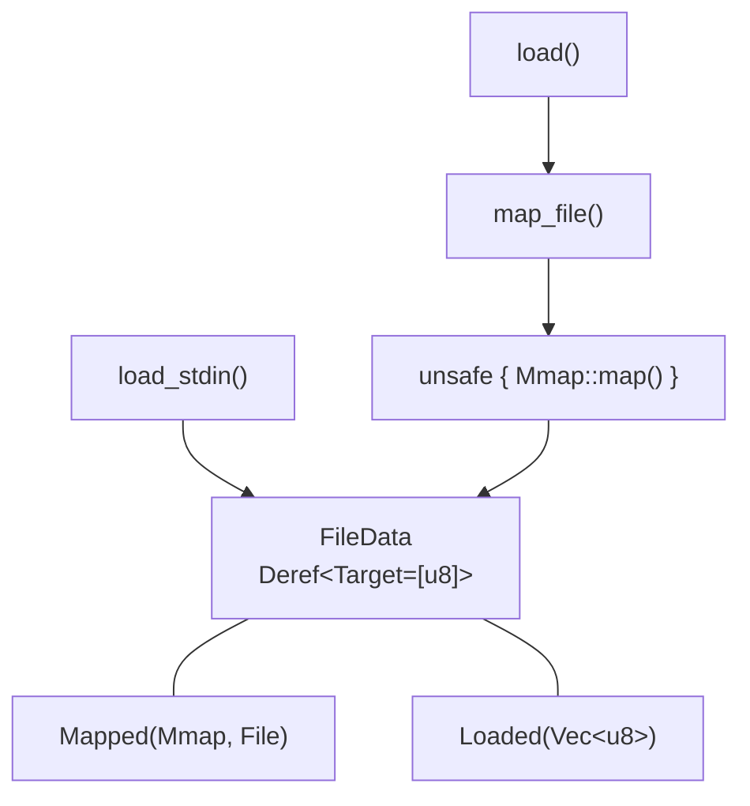

# mmap-guard

[![GitHub License][license-badge]][license-link] [![GitHub Sponsors][sponsors-badge]][sponsors-link]

[![GitHub Actions Workflow Status][ci-badge]][ci-link] [![docs.rs][docs-badge]][docs-link] [![Deps.rs Repository Dependencies][deps-badge]][deps-link]

[![Codecov][codecov-badge]][codecov-link] [![GitHub issues][issues-badge]][issues-link] [![GitHub last commit][last-commit-badge]][commits-link]

[![Crates.io][crates-badge]][crates-link] [![Crates.io MSRV][msrv-badge]][crates-link]

---

[![OpenSSF Scorecard][scorecard-badge]][scorecard-link]

---

Safe, guarded memory-mapped file I/O for Rust. Wraps [`memmap2::Mmap::map()`](https://docs.rs/memmap2) behind a safe API so downstream crates can use `#![forbid(unsafe_code)]` while still benefiting from zero-copy file access.

## Why mmap-guard?

Projects that enforce `#![forbid(unsafe_code)]` cannot call `memmap2::Mmap::map()` directly because it is `unsafe`. The alternative — `std::fs::read()` — copies the entire file into heap memory, which is impractical for disk images and multi-gigabyte binaries.

**mmap-guard** bridges this gap by **isolating** the unsafe boundary in a single, focused crate. By centralizing it here, we can concentrate testing, fuzzing, and hardening efforts on that one point — so every consumer benefits from those protections without reasoning about mmap safety themselves.

## Features

- **Safe mmap construction** — wraps `memmap2::Mmap::map()` with pre-flight checks (empty file detection, permission errors)
- **Advisory file locking** — acquires a shared advisory lock (via `fs4`) before mapping; returns `io::ErrorKind::WouldBlock` on lock contention
- **Platform quirk mitigation** — documents and (where possible) mitigates SIGBUS/access violations from file truncation
- **Unified read API** — returns `&[u8]` whether backed by mmap or a heap buffer (for stdin/non-seekable inputs)
- **Zero unsafe for consumers** — exactly one `unsafe` block, fully documented with a `// SAFETY:` comment
- **Minimal dependencies** — `memmap2` and `fs4` at runtime

## Quick Start

### Installation

Add to your `Cargo.toml`:

```toml
[dependencies]
mmap-guard = "0.1"
```

### Usage

```rust
use mmap_guard::map_file;

// Memory-map a file — returns FileData that derefs to &[u8]
let data = map_file("large-file.bin")?;
assert!(!data.is_empty());
// Use it like any byte slice
println!("first byte: {:#04x}", data[0]);
```

For CLI tools that accept both file paths and stdin:

```rust
use mmap_guard::{load, load_stdin};
use std::path::Path;

let path = Path::new("input.txt");
let data = if path == Path::new("-") {
    load_stdin()?
} else {
    load(path)?
};
```

## Architecture



| Module             | Purpose                                                             |
| ------------------ | ------------------------------------------------------------------- |
| `src/lib.rs`       | Crate-level docs, re-exports public API                             |
| `src/map.rs`       | `map_file()` with pre-flight stat check; the single `unsafe` block  |
| `src/load.rs`      | `load()` delegates to `map_file()`; `load_stdin()` reads to heap    |
| `src/file_data.rs` | `FileData` enum (`Mapped(Mmap, File)` / `Loaded`), `Deref`, `AsRef` |

## What It Does NOT Do

- Provide mutable/writable mappings
- Abstract over async I/O
- Implement its own mmap syscalls (delegates entirely to `memmap2`)

## Safety

This crate contains exactly **one** `unsafe` block — the call to `memmap2::Mmap::map()`. The safety contract is maintained through:

- File opened read-only (`File::open()`)
- Shared advisory lock acquired via `fs4` before mapping — contention returns `io::ErrorKind::WouldBlock`
- File descriptor and lock held through ownership in `FileData::Mapped(Mmap, File)` — released on drop
- No mutable aliasing (read-only mappings only)
- `#![deny(clippy::undocumented_unsafe_blocks)]` enforced

See the [safety documentation](https://evilbitlabs.io/mmap-guard/safety.html) for the full contract and known limitations (SIGBUS from concurrent file truncation).

## Security

- **Strict linting** — pedantic/nursery/cargo clippy groups, `unwrap_used` denied, `panic` denied
- **Dependency auditing** — `cargo audit` and `cargo deny` in CI
- **Coverage threshold** — 80%+ project coverage enforced
- **Supply chain** — OpenSSF Scorecard monitoring

## Documentation

- [Developer Guide](https://evilbitlabs.io/mmap-guard/) — mdBook documentation
- [API Reference](https://docs.rs/mmap-guard) — docs.rs
- [GitHub Issues](https://github.com/EvilBit-Labs/mmap-guard/issues)

## Contributing

See [CONTRIBUTING.md](CONTRIBUTING.md) for development setup and guidelines.

## License

Licensed under the Apache License 2.0 — see [LICENSE](LICENSE) for details.

## Acknowledgments

- [memmap2](https://github.com/RazrFalcon/memmap2-rs) for the underlying memory-mapping implementation
- The Rust community for excellent tooling and ecosystem

[ci-badge]: https://img.shields.io/github/actions/workflow/status/EvilBit-Labs/mmap-guard/ci.yml?style=flat-square
[ci-link]: https://github.com/EvilBit-Labs/mmap-guard/actions/workflows/ci.yml
[codecov-badge]: https://img.shields.io/codecov/c/github/EvilBit-Labs/mmap-guard?style=flat-square&logoColor=white&logo=codecov
[codecov-link]: https://app.codecov.io/gh/EvilBit-Labs/mmap-guard
[commits-link]: https://github.com/EvilBit-Labs/mmap-guard/commits/main
[crates-badge]: https://img.shields.io/crates/v/mmap-guard?style=flat-square&logo=rust
[crates-link]: https://crates.io/crates/mmap-guard
[deps-badge]: https://img.shields.io/deps-rs/repo/github/EvilBit-Labs/mmap-guard?style=flat-square
[deps-link]: https://deps.rs/repo/github/EvilBit-Labs/mmap-guard
[docs-badge]: https://img.shields.io/docsrs/mmap-guard?style=flat-square
[docs-link]: https://docs.rs/mmap-guard
[issues-badge]: https://img.shields.io/github/issues/EvilBit-Labs/mmap-guard?style=flat-square&logo=github
[issues-link]: https://github.com/EvilBit-Labs/mmap-guard/issues
[last-commit-badge]: https://img.shields.io/github/last-commit/EvilBit-Labs/mmap-guard?style=flat-square&logo=github
[license-badge]: https://img.shields.io/github/license/EvilBit-Labs/mmap-guard?style=flat-square&logo=github
[license-link]: https://github.com/EvilBit-Labs/mmap-guard/blob/main/LICENSE
[msrv-badge]: https://img.shields.io/crates/msrv/mmap-guard?style=flat-square&logo=rust
[scorecard-badge]: https://api.scorecard.dev/projects/github.com/EvilBit-Labs/mmap-guard/badge?style=flat-square
[scorecard-link]: https://scorecard.dev/viewer/?uri=github.com/EvilBit-Labs/mmap-guard
[sponsors-badge]: https://img.shields.io/github/sponsors/EvilBit-Labs?style=flat-square&logo=github
[sponsors-link]: https://github.com/sponsors/EvilBit-Labs
