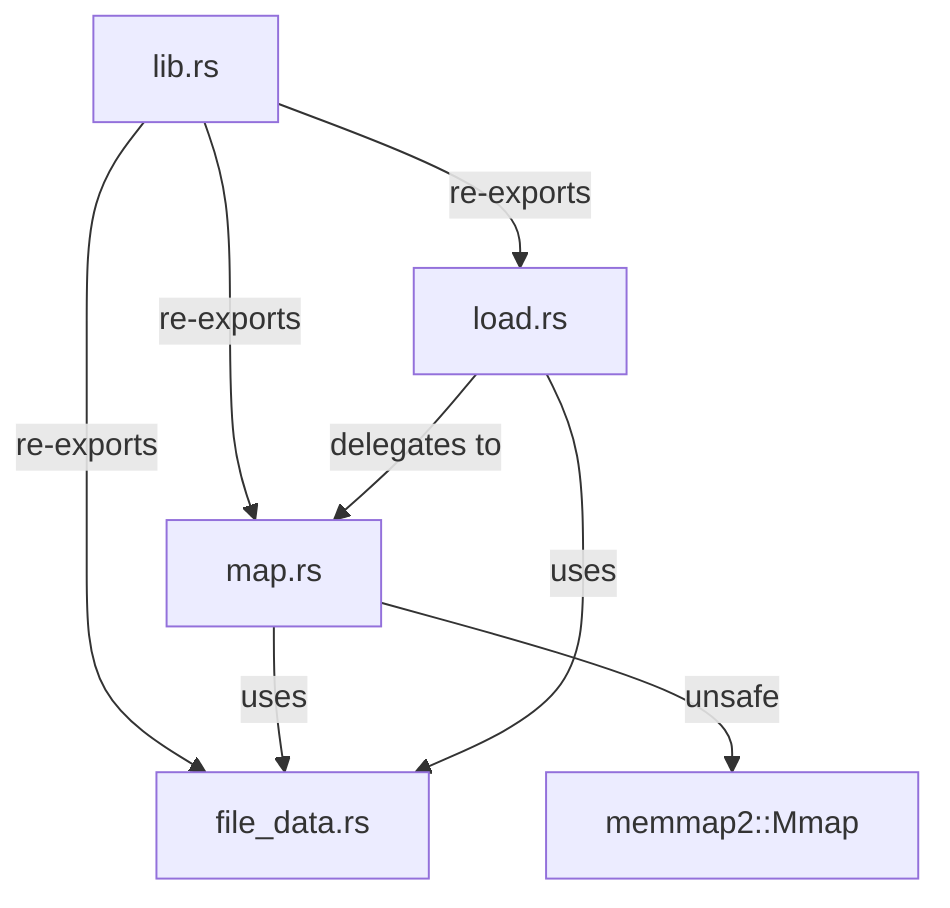
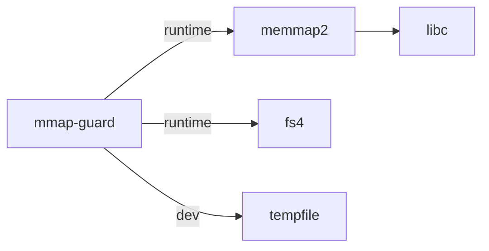

# Architecture Overview

mmap-guard is intentionally thin. The entire crate consists of four source files.

## Module Structure

### `lib.rs`

Crate root. Sets `#![deny(clippy::undocumented_unsafe_blocks)]` and re-exports the public API:

- `FileData`
- `map_file`
- `load`, `load_stdin`

### `file_data.rs`

Defines the `FileData` enum — the unified type returned by all public functions. Both variants (`Mapped` and `Loaded`) deref to `&[u8]`.

### `map.rs`

Contains `map_file()` and the **single `unsafe` block** in the crate. Performs pre-flight checks (file exists, non-empty) before creating the memory mapping.

### `load.rs`

Convenience layer. `load()` delegates to `map_file()` for regular files. `load_stdin()` reads stdin into a heap buffer and returns `FileData::Loaded`.

## Dependency Graph

The crate has two runtime dependencies (`memmap2` and `fs4`) and one dev-dependency (`tempfile`).
