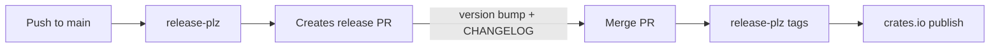

# Release Process

mmap-guard uses an automated release pipeline with [release-plz](https://release-plz.dev/) and [git-cliff](https://git-cliff.org/) for changelog generation.

## How It Works



1. **Commits land on `main`** — via merged PRs
2. **release-plz analyzes commits** — only `feat`, `fix`, `refactor`, `perf` trigger a version bump
3. **Release PR is created** — with version bump and generated CHANGELOG
4. **Mergify auto-merges** the release PR after DCO check passes
5. **release-plz creates a git tag** and publishes to crates.io

## Changelog Generation

Changelogs are generated by git-cliff using conventional commits. Commit types map to sections:

| Commit prefix | Changelog section   |
| ------------- | ------------------- |
| `feat`        | Features            |
| `fix`         | Bug Fixes           |
| `refactor`    | Refactor            |
| `perf`        | Performance         |
| `doc`         | Documentation       |
| `test`        | Testing             |
| `chore`, `ci` | Miscellaneous Tasks |

Dependency updates (`chore(deps)`) and merge commits are excluded.

## Manual Release Commands

For local verification:

```bash
# Dry run — see what would happen
just release-dry-run

# Generate changelog preview
just changelog

# Specific version bumps (rarely needed — release-plz handles this)
just release-patch
just release-minor
just release-major
```

## Security Auditing

Releases are protected by automated security checks:

- **cargo-audit** — runs daily and on dependency changes
- **cargo-deny** — checks licenses, bans, advisories, sources
- **OSSF Scorecard** — supply-chain security assessment
