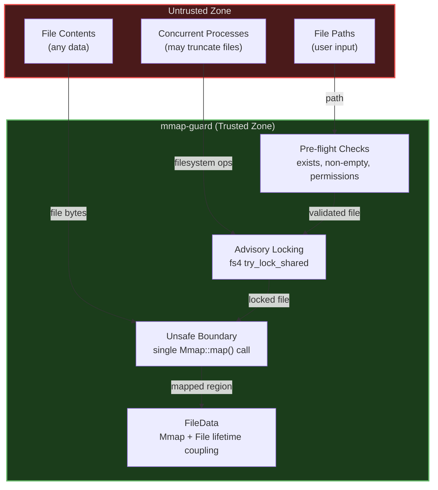

# Security Assurance Case

This document provides a structured argument that mmap-guard meets its security requirements.

### Frameworks Referenced

This assurance case draws on three complementary frameworks:

- **[NIST IR 7608](https://csrc.nist.gov/publications/detail/nistir/7608/final)** -- structured assurance case model. Provides the overall argument structure (security requirements, threat model, trust boundaries, countermeasures).
- **[NIST SSDF (SP 800-218)](https://csrc.nist.gov/pubs/sp/800/218/final)** -- Secure Software Development Framework. Maps our development practices to the four SSDF practice groups (PO, PS, PW, RV). See [Section 10](#10-ssdf-practice-mapping).
- **[SLSA v1.0](https://slsa.dev/spec/v1.0/levels)** -- Supply-chain Levels for Software Artifacts. Defines progressive build integrity levels. See [Section 11](#11-slsa-build-level-assessment).

## 1. Security Requirements

mmap-guard is a safe wrapper around `memmap2::Mmap::map()` that isolates the single `unsafe` call behind a hardened boundary. Its security requirements are:

1. **SR-1**: Must not exhibit undefined behavior when mapping any file
2. **SR-2**: Must not allow use-after-unmap of memory-mapped regions
3. **SR-3**: Must not create mutable aliasing of mapped memory
4. **SR-4**: Must not allow path traversal via file path arguments
5. **SR-5**: Must validate all pre-flight conditions (non-empty, permissions) before the `unsafe` mmap call
6. **SR-6**: Must hold advisory locks for the full lifetime of the mapping
7. **SR-7**: Must not leak file descriptors or mappings across `FileData` instances

## 2. Threat Model

### 2.1 Assets

- **Host system**: The machine running mmap-guard
- **Mapped file contents**: Data being mapped (may be sensitive)
- **File descriptors**: OS resources held by `FileData::Mapped`

### 2.2 Threat Actors

| Actor                 | Motivation                                               | Capability                                            |
| --------------------- | -------------------------------------------------------- | ----------------------------------------------------- |
| Malicious file author | Exploit the mmap call to cause undefined behavior or DoS | Can craft arbitrary file contents                     |
| Concurrent process    | Truncate or modify a mapped file to trigger SIGBUS       | Can write to or truncate files on the same filesystem |
| Supply chain attacker | Compromise a dependency to inject unsafe code            | Can publish malicious crate versions                  |

### 2.3 Attack Vectors

| ID   | Vector                                                                   | Target SR        |
| ---- | ------------------------------------------------------------------------ | ---------------- |
| AV-1 | Crafted file triggers undefined behavior in the `unsafe` mmap call       | SR-1             |
| AV-2 | Concurrent truncation causes SIGBUS (Unix) or access violation (Windows) | SR-1             |
| AV-3 | Empty file causes panic in mapping                                       | SR-1, SR-5       |
| AV-4 | TOCTOU race between stat check and mmap call                             | SR-5             |
| AV-5 | Compromised dependency introduces unsafe code                            | SR-1, SR-2, SR-3 |

## 3. Trust Boundaries

All data crossing the trust boundary (file paths, file contents) is treated as untrusted and validated before use. Concurrent processes are mitigated through cooperative advisory locking.

## 4. Secure Design Principles (Saltzer and Schroeder)

| Principle                       | How Applied                                                                                                                                                                                    |
| ------------------------------- | ---------------------------------------------------------------------------------------------------------------------------------------------------------------------------------------------- |
| **Economy of mechanism**        | Thin wrapper with 4 source files and 2 runtime dependencies (`memmap2`, `fs4`). No plugin system, no network I/O, no configuration files.                                                      |
| **Fail-safe defaults**          | Pre-flight checks reject empty files and permission errors before reaching `unsafe` code. Advisory lock uses `try_lock_shared` (non-blocking), returning `WouldBlock` rather than deadlocking. |
| **Complete mediation**          | Every file path goes through the full open -> stat -> lock -> map pipeline. No shortcut paths bypass validation.                                                                               |
| **Open design**                 | Fully open source (Apache-2.0). Security does not depend on obscurity. All safety mechanisms are publicly documented.                                                                          |
| **Separation of privilege**     | `map.rs` (unsafe boundary) and `load.rs` (convenience layer) are separate modules with distinct responsibilities.                                                                              |
| **Least privilege**             | Read-only mappings only. No mutable or writable mappings are created. No write, execute, or network capabilities.                                                                              |
| **Least common mechanism**      | No shared mutable state. Each `FileData` instance is independent with its own file descriptor and advisory lock.                                                                               |
| **Psychological acceptability** | Standard `io::Result` error handling. Familiar `Deref<Target=[u8]>` API. Consumers treat `FileData` as `&[u8]` without caring about the backing storage.                                       |

## 5. The Unsafe Boundary

Unlike most Rust crates which use `#![forbid(unsafe_code)]`, mmap-guard **is** the unsafe boundary. It exists specifically to contain the one `unsafe` call that downstream `#![forbid(unsafe_code)]` crates cannot make themselves.

The crate enforces:

- **Exactly one `unsafe` block** in the entire crate (in `src/map.rs`). Adding new ones requires an issue discussion.
- **`#![deny(clippy::undocumented_unsafe_blocks)]`** -- every `unsafe` block must have a `// SAFETY:` comment explaining why the invariants are upheld.
- **Strict clippy lints**: `unwrap_used = "deny"`, `panic = "deny"`, full pedantic/nursery/cargo groups enabled.

### Safety Invariants

The safety of `memmap2::Mmap::map()` relies on these conditions, all of which mmap-guard upholds:

| Invariant                   | How It's Upheld                                                                                                  |
| --------------------------- | ---------------------------------------------------------------------------------------------------------------- |
| File opened read-only       | `File::open()` opens in read-only mode                                                                           |
| File descriptor stays alive | `File` is kept alive inside `FileData::Mapped` for the full mapping lifetime                                     |
| No use-after-unmap          | `&[u8]` lifetime is tied to `FileData` via `Deref`                                                               |
| No mutable aliasing         | Only read-only mappings are created                                                                              |
| Advisory lock held          | `fs4::FileExt::try_lock_shared` is called before mapping; the lock-owning `File` lives inside `FileData::Mapped` |

## 6. Common Weakness Countermeasures

### 6.1 CWE/SANS Top 25

| CWE     | Weakness                  | Countermeasure                                                                                                                                                                        | Status              |
| ------- | ------------------------- | ------------------------------------------------------------------------------------------------------------------------------------------------------------------------------------- | ------------------- |
| CWE-416 | Use after free            | Rust ownership system prevents use-after-free at compile time. `Mmap` and `File` are co-located in `FileData::Mapped`, ensuring the mapping and file descriptor are dropped together. | Mitigated           |
| CWE-476 | NULL pointer dereference  | Rust's `Option` type eliminates null pointer dereferences at compile time.                                                                                                            | Mitigated           |
| CWE-125 | Out-of-bounds read        | Memory-mapped regions have a known size derived from `File::metadata()`. `Deref` returns a slice with correct bounds.                                                                 | Mitigated           |
| CWE-22  | Path traversal            | Read-only access only. Paths are resolved by `std::fs::File::open()` with no path construction from file contents.                                                                    | Mitigated           |
| CWE-20  | Improper input validation | Pre-flight checks validate file existence, non-empty size, and permissions before the `unsafe` call.                                                                                  | Mitigated           |
| CWE-400 | Resource exhaustion       | Empty file pre-check prevents zero-length mapping. `try_lock_shared` returns `WouldBlock` instead of blocking indefinitely.                                                           | Mitigated           |
| CWE-190 | Integer overflow          | File size comes from OS metadata via `std::fs::Metadata::len()`, which returns `u64`. No manual arithmetic on sizes.                                                                  | Mitigated           |
| CWE-362 | Race condition (TOCTOU)   | Advisory lock acquired between stat check and mmap call reduces the window. Fully preventing TOCTOU requires OS-level guarantees beyond advisory locking.                             | Partially mitigated |
| CWE-787 | Out-of-bounds write       | Not applicable -- only read-only mappings are created. No writes to mapped memory.                                                                                                    | N/A                 |
| CWE-78  | OS command injection      | Not applicable -- no shell invocation or command execution.                                                                                                                           | N/A                 |
| CWE-89  | SQL injection             | Not applicable -- no database.                                                                                                                                                        | N/A                 |
| CWE-79  | XSS                       | Not applicable -- no web output.                                                                                                                                                      | N/A                 |

### 6.2 OWASP Top 10 (where applicable)

Most OWASP Top 10 categories target web applications and are not applicable to a memory-mapping library. The applicable items are:

| Category                   | Applicability | Countermeasure                                                                   |
| -------------------------- | ------------- | -------------------------------------------------------------------------------- |
| A04: Insecure Design       | Applicable    | Secure design principles applied throughout (see Section 4)                      |
| A06: Vulnerable Components | Applicable    | `cargo audit` daily, `cargo deny`, Dependabot, OSSF Scorecard                    |
| A09: Security Logging      | Partial       | Errors returned via `io::Result`; security events reported via GitHub Advisories |

## 7. Known Limitation: SIGBUS / Access Violation

If the underlying file is **truncated or modified by another process** while mapped, the operating system may deliver:

- **Unix**: `SIGBUS` signal
- **Windows**: Access violation (structured exception)

This is inherent to memory-mapped I/O and **cannot be fully prevented**. It is explicitly out of scope for security reports (see [SECURITY.md](https://github.com/EvilBit-Labs/mmap-guard/blob/main/SECURITY.md)).

### Mitigation

mmap-guard acquires a cooperative shared advisory lock via `fs4::FileExt::try_lock_shared` before creating the mapping. This is advisory only -- it relies on other processes cooperating. The lock and mapping lifetimes are coupled through `FileData::Mapped(Mmap, File)`.

For applications needing stronger guarantees:

1. **Advisory locking** -- rely on mmap-guard's built-in shared lock (cooperative)
2. **Signal handling** -- install a `SIGBUS` handler that can recover gracefully (complex and platform-specific)
3. **Copy-on-read** -- for small files, prefer `std::fs::read()` via the `FileData::Loaded` path

## 8. Supply Chain Security

| Measure             | Implementation                                                                        |
| ------------------- | ------------------------------------------------------------------------------------- |
| Dependency auditing | `cargo audit` and `cargo deny` run daily in CI                                        |
| Dependency updates  | Dependabot configured for weekly automated PRs (cargo, github-actions, devcontainers) |
| Pinned toolchain    | Rust stable via mise                                                                  |
| Reproducible builds | `Cargo.lock` and `mise.lock` committed                                                |
| SBOM generation     | `cargo-cyclonedx` produces CycloneDX SBOM attached to GitHub Releases                 |
| Build provenance    | Sigstore attestation of the crate tarball (`cargo package` output)                    |
| CI integrity        | All GitHub Actions pinned to SHA hashes                                               |
| Code review         | Required on all PRs                                                                   |
| OSSF Scorecard      | Weekly supply-chain assessment with SARIF upload to GitHub code-scanning              |
| Banned dependencies | `cargo deny` blocks `openssl`, `git2`, `cmake`, `libssh2-sys`, unknown registries     |

**Note**: `cargo-auditable` is not applicable -- it embeds dependency metadata in ELF/PE binaries, which do not exist for a library crate. SBOM and provenance attestation cover the equivalent supply chain visibility.

## 9. Ongoing Assurance

This assurance case is maintained as a living document. It is updated when:

- New features introduce new attack surfaces
- New threat vectors are identified
- Dependencies change significantly
- Security incidents occur

The project maintains continuous assurance through automated CI checks (clippy, cargo audit, cargo deny, OSSF Scorecard) that run on every commit and on daily schedules.

## 10. SSDF Practice Mapping

This section maps mmap-guard's development practices to the [NIST Secure Software Development Framework (SP 800-218)](https://csrc.nist.gov/pubs/sp/800/218/final) practice groups.

### PO: Prepare the Organization

| Task                                             | Implementation                                                                | Status |
| ------------------------------------------------ | ----------------------------------------------------------------------------- | ------ |
| PO.1: Define security requirements               | Security requirements SR-1 through SR-7 defined in this document              | Done   |
| PO.3: Implement supporting toolchains            | mise manages all dev tools; pre-commit hooks enforce checks locally           | Done   |
| PO.5: Implement and maintain secure environments | CI runs on ephemeral GitHub Actions runners; minimal permissions per workflow | Done   |

### PS: Protect the Software

| Task                                                                   | Implementation                                                                       | Status  |
| ---------------------------------------------------------------------- | ------------------------------------------------------------------------------------ | ------- |
| PS.1: Protect all forms of code from unauthorized access and tampering | GitHub branch protection on `main`; Mergify merge protections; required PR reviews   | Done    |
| PS.2: Provide a mechanism for verifying software release integrity     | CycloneDX SBOM attached to GitHub Releases; Sigstore attestation of crate tarball    | Planned |
| PS.3: Archive and protect each software release                        | GitHub Releases with tagged versions; crates.io immutable publishing via release-plz | Done    |

### PW: Produce Well-Secured Software

| Task                                                                               | Implementation                                                                                                              | Status |
| ---------------------------------------------------------------------------------- | --------------------------------------------------------------------------------------------------------------------------- | ------ |
| PW.1: Design software to meet security requirements                                | Saltzer and Schroeder principles applied (Section 4); single unsafe block policy                                            | Done   |
| PW.4: Reuse existing, well-secured software                                        | Delegates to `memmap2` (vetted mmap wrapper) and `fs4` (advisory locking)                                                   | Done   |
| PW.5: Create source code by adhering to secure coding practices                    | `clippy::undocumented_unsafe_blocks = "deny"`, `unwrap_used = "deny"`, `panic = "deny"`, pedantic/nursery/cargo lint groups | Done   |
| PW.6: Configure the compilation and build processes to improve executable security | Release builds via `cargo build --release`; all clippy lints promoted to errors in CI                                       | Done   |
| PW.7: Review and/or analyze human-readable code to identify vulnerabilities        | Required PR reviews; OSSF Scorecard; cargo clippy with strict configuration                                                 | Done   |
| PW.8: Test executable code to identify vulnerabilities                             | nextest on 4-platform matrix; 85% coverage threshold enforced; cargo audit and cargo deny                                   | Done   |

### RV: Respond to Vulnerabilities

| Task                                                           | Implementation                                                                    | Status |
| -------------------------------------------------------------- | --------------------------------------------------------------------------------- | ------ |
| RV.1: Identify and confirm vulnerabilities on an ongoing basis | Daily `cargo audit` and `cargo deny` in CI; weekly OSSF Scorecard; Dependabot PRs | Done   |
| RV.2: Assess, prioritize, and remediate vulnerabilities        | SECURITY.md defines scope, reporting channels, and 90-day fix target              | Done   |
| RV.3: Analyze vulnerabilities to identify their root causes    | Security advisories coordinated via GitHub Private Vulnerability Reporting        | Done   |

## 11. SLSA Build Level Assessment

This section assesses mmap-guard's current [SLSA v1.0](https://slsa.dev/spec/v1.0/levels) build level and identifies gaps for advancement.

### Current Level: Build L1

| Requirement                                                       | Status | Evidence                                                                                                     |
| ----------------------------------------------------------------- | ------ | ------------------------------------------------------------------------------------------------------------ |
| **Build L1**: Provenance exists showing how the package was built | Met    | CI workflow on GitHub Actions; build logs publicly visible; `release-plz` automates crate publishing from CI |

### Build L2 Requirements (target)

| Requirement                                            | Status  | Gap                                                                                                |
| ------------------------------------------------------ | ------- | -------------------------------------------------------------------------------------------------- |
| Builds run on a hosted build service                   | Met     | GitHub Actions (ephemeral runners)                                                                 |
| Build service generates provenance                     | Partial | GitHub Actions provides workflow run metadata, but no signed SLSA provenance document is generated |
| Provenance is signed by the build service              | Not yet | Need to add `slsa-framework/slsa-github-generator` or Sigstore attestation to the release workflow |
| Provenance is complete (source, builder, build config) | Not yet | Requires SLSA provenance generator integration                                                     |

### Build L3 Requirements (aspirational)

| Requirement                          | Status  | Gap                                                                                          |
| ------------------------------------ | ------- | -------------------------------------------------------------------------------------------- |
| Hardened build platform              | Partial | GitHub Actions provides isolation between jobs, but not the full L3 hermetic build guarantee |
| Builds are isolated from one another | Met     | Each CI run uses a fresh ephemeral runner                                                    |
| Provenance is unforgeable            | Not yet | Requires L2 first                                                                            |

### Roadmap to Build L2

1. Add `slsa-framework/slsa-github-generator` to the release workflow to produce signed SLSA provenance
2. Attach the provenance attestation to the GitHub Release alongside the SBOM
3. Document verification steps for consumers (`slsa-verifier`)
